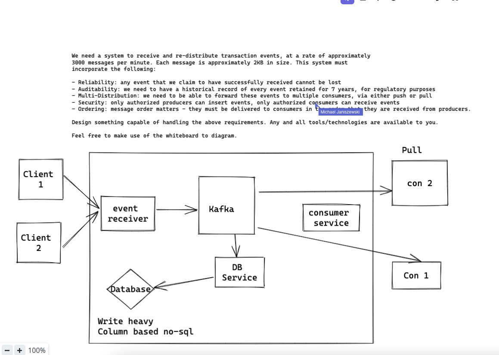
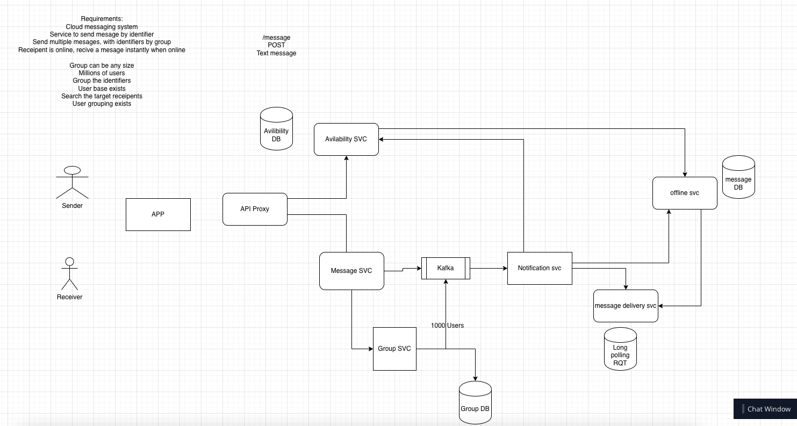

# Round 1
Michael Janiszewski, Eng - Software Development VI
> ## Algorithm Question
> [Permutations](Permutations.java)
> ## System Design Question
> 

# Round 2
Ryan Lo, Senior Software Engineer - Payments
> ## Algorithm Question
> [LRU Cache](LRUCache.java)

# Round 3
Victor Chau, Director of Engineering
> ## Algorithm Question
> [Stack Implementation](StackImplementation.java)
> ## System Design Question
> 